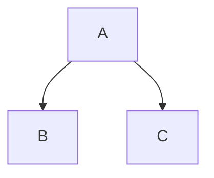

Testing Markdown!
================
The above was Headline lvl 1, below is lvl 2 and subsequent levels can be achieved by increasing the number of hashtags

Headline lvl 2
--------------

Theres two types of **Bold**: one using two asterisks on either side of the text and another using __underscores__ in the same fashion

You can also *italicize* using one of the above _symbols_ either side

~~Use tildes on either side to strikethrough, although this doesn't seem to work for me :-( (In the Preview)~~

> A "greater than" symbol followed by a single space is used to mark a quotation

Three consecutive dashes (space to differentiate from Headline lvl 2)
- - -
Asterisks
***
and Underscores are used for a horizontal rule!
___

Lists can be made using:
- Hyphens
  * Asterisks
    + or Plus signs. Cool!

1. You can also create ordered list items by starting with a number and a period.
2. Numbers don't really matter because Markdown will continue to the next one.

### LINKS
Just putting a link (https://www.linkedin.com) works

[Website Name in square brackets] (followed by www.link.com in brackets also works "link.com"(No space between them!))

[LinkedIn](https://www.linkedin.com "LinkedIn")

Images can be linked by adding a "!" before the normal link format
[](https://github.com/dee-sakwe)

Use tickmarks to show a piece of `CODE`

```py
# Enclose code in three tickmarks to create a code block
# Also put a language reference so that it colour codes your code

def markdown():
  if True:
    print("This is a nifty way to showcase coding in Python!")
```

# Github Flavoured Markdown

### 1. Footnotes:

This is footnote[^1] and footnote[^2]

[^1]: OneFootnote
[^2]: AnotherFootnote


### 2. Tables

| Left | Center | Right |
| ---- | :----: | ----: |
| One  | Two    | $1.00 |
| Tree | Fore   | $5.00 |


### 3. "/" Help
"/" Useful in the pull requests interface to bring up a help menu


### 4. Task List

- [x] First checked item
     - [x] first subitem checked
     - [ ] second subitem unchecked
- [ ] Second item unchecked


### 5. Specials 

- You can drag and drop things like .png, .gif, .jpg, .xlsx, .mov etc
- '#' and @ mentions work in pull requests, issues and discussions
- rgb, hex, hsl (#FABCDE)
- Emojis with : 😃
- Escape with \ \# MARKDOWN ROCKS!
  

### 6. Alert Syntax

> [!NOTE]
> A note

> [!IMPORTANT]
> Important

> [!WARNING]
> Warning


### 7. Special Content (Graphs)


mermaid and others
    

### 8. Disallowed Raw HTML

> `<title>`, `<script>`, `<xmp>` etc not allowed


### 9. Collapsed Details

<details>
<summary>collapsed</summary>

# Header

This is the copy for the collapsed text.
<details>
